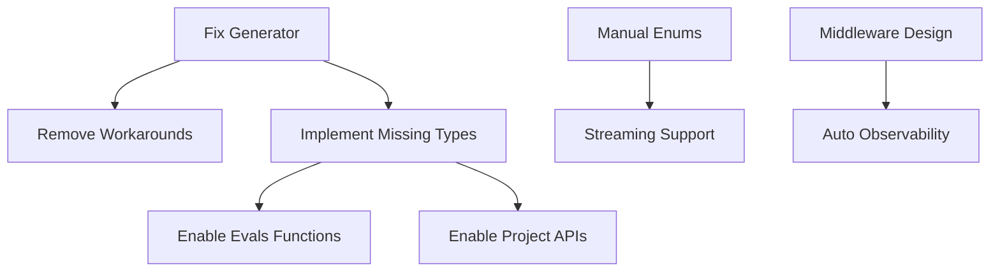

# OpenAI Builders Tasks Breakdown

> Actionable tasks derived from TODO sweep findings

## Critical Generator Fixes

### Task 1: Fix Streaming Event Enums
**Priority**: P0 - Blocking
**Files**: `src/streaming.rs`
**Issue**: MessageStreamEvent and RunStreamEvent enums are empty
**Action**:
- [ ] Update OpenAPI spec or generator config to produce proper enum variants
- [ ] Implement manual enums as temporary workaround
- [ ] Add comprehensive tests for all event types

### Task 2: Fix Response Tool Fields
**Priority**: P0 - Blocking
**Files**: `src/responses.rs`
**Issue**: tools and tool_choice fields have type mismatches
**Action**:
- [ ] Investigate correct types in OpenAPI spec
- [ ] Fix generator mapping for these fields
- [ ] Update response builder to handle tools properly

### Task 3: Generate Missing Project Types
**Priority**: P1 - High
**Files**: `src/projects.rs`
**Issue**: ProjectApiKeyCreateRequest doesn't exist
**Action**:
- [ ] Add missing type to OpenAPI spec
- [ ] Regenerate client with new type
- [ ] Implement project API key management functions

## Implementation Tasks

### Task 4: Complete Evals Module
**Priority**: P2 - Medium
**Files**: `src/evals.rs`
**Issue**: Functions commented out due to missing request types
**Action**:
- [ ] Define CreateEvalRequest with required fields
- [ ] Define CreateEvalRunRequest with required fields
- [ ] Uncomment and test eval functions
- [ ] Add integration tests

### Task 5: Extend Observability Coverage
**Priority**: P2 - Medium
**Files**: `src/observability.rs`
**Issue**: Missing support for 5 endpoint categories
**Action**:
- [ ] Add embeddings observability
- [ ] Add fine-tuning observability
- [ ] Add files observability
- [ ] Add models observability
- [ ] Add moderations observability

### Task 6: File Download Enhancement
**Priority**: P2 - Medium
**Files**: `src/files.rs`
**Issue**: download_file returns String instead of bytes
**Action**:
- [ ] Create download_file_bytes wrapper function
- [ ] Handle binary data properly
- [ ] Add streaming download support

## Architecture Improvements

### Task 7: Middleware Pattern for Observability
**Priority**: P3 - Low
**Files**: `src/observability.rs`, `src/middleware.rs`
**Issue**: Manual instrumentation required
**Action**:
- [ ] Design middleware architecture
- [ ] Implement automatic request/response capture
- [ ] Add configurable observability levels
- [ ] Create middleware examples

### Task 8: Realtime Module Type Adaptation
**Priority**: P3 - Low
**Files**: `src/realtime.rs`
**Issue**: Types changed from enums to strings
**Action**:
- [ ] Document all type changes
- [ ] Create type conversion utilities
- [ ] Add validation for string types
- [ ] Update examples for new types

## Testing & Documentation

### Task 9: Test Coverage for Workarounds
**Priority**: P1 - High
**Action**:
- [ ] Unit tests for manual enum implementations
- [ ] Integration tests for field type fixes
- [ ] Mock tests for missing types
- [ ] Document all workarounds in code

### Task 10: Update Documentation
**Priority**: P2 - Medium
**Files**: `README.md`, inline docs
**Action**:
- [ ] Document known generator issues
- [ ] Add workaround examples
- [ ] Update API usage examples
- [ ] Create migration guide for breaking changes

## Grouped by Effort

### Quick Wins (< 2 hours each)
- Document known issues
- Create type aliases for workarounds
- Add TODO tracking to main TODO.md

### Medium Tasks (2-8 hours each)
- Manual enum implementations
- File download wrapper
- Evals function fixes
- Basic observability extensions

### Large Tasks (> 8 hours)
- Generator configuration fixes
- Middleware architecture
- Complete observability coverage
- Comprehensive test suite

## Dependencies

## Success Metrics

- [ ] All TODOs have tracking issues
- [ ] No functions remain commented out
- [ ] All streaming events handled
- [ ] Tools/tool_choice working in responses
- [ ] 100% test coverage for workarounds
- [ ] Documentation complete for all issues